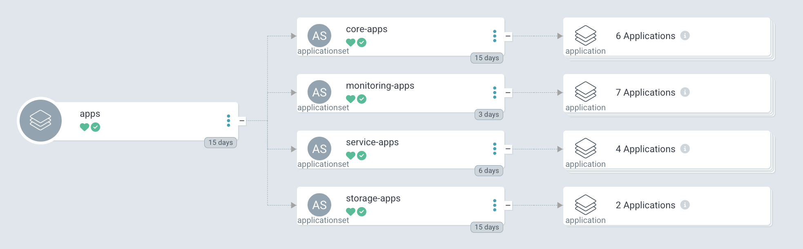

# Homelab



> Work in progress. Slowly migrating apps to this setup/repo from previous repo gradually while applying everything learned over the past year.

Infrastructure-as-code for my homelab running on Proxmox. This repo provisions Kubernetes clusters (at the moment switch to one main cluster and one playground) using Talos, deploys applications via ArgoCD and Helmfile, and manages everything through Terragrunt. 

Secrets are encrypted with SOPS using age keys.

## How it works

The infrastructure layer uses Terragrunt to provision VMs on Proxmox and bootstrap the Talos cluster. Once a cluster is up, ArgoCD takes over and deploys applications using an app-of-apps pattern. Each application has its own helmfile that gets rendered by the ArgoCD Helmfile plugin.

Container images are synced to a private docker registry, and Helm charts are published to GitLab's repo package registry, thus keeping everything internal and avoiding rate limits from public registries.

## Repo structure

```
homelab/
├── apps/                    # application deployments
│   ├── _argocd/             # app-of-apps with ApplicationSets
│   ├── core/                # platform essentials (traefik, cert-manager, cilium, etc)
│   ├── monitoring/          # observability stack (prometheus, grafana, loki, tempo)
│   ├── storage/             # cnpg, longhorn
│   └── services/            # user-facing apps (gitlab, blog, actual, etc)
│
├── charts/                  # custom helm charts
│
├── infrastructure/          # terragrunt configurations
│   ├── root.hcl             # root config with providers and remote state
│   ├── _envcommon/          # shared terragrunt configs
│   ├── avalon/              # proxmox node (control plane)
│   │   └── clusters/aion/   # cluster config, cp nodes, oidc
│   ├── elysium/             # proxmox node (running workers)
│   │   └── clusters/aion/   # worker nodes
│   └── images/              # container image sync definitions
│
├── dashboards/              # grafana dashboards
└── secrets/                 # sops-encrypted secrets
```

Each application in `apps/` follows a standard layout: an `argocd.yaml` for ArgoCD metadata, a `helmfile.yaml.gotmpl` for chart configuration, and a `values.yaml.gotmpl` for environment-specific values.

## Stack

- **infrastructure**: Proxmox VE, Terragrunt, Terraform (I use OpenTofu but well "same same but different")
- **kubernetes**: Talos (v1.12), Cilium CNI, Traefik ingress
- **gitops**: ArgoCD with Helmfile plugin, Helm charts published to GitLab
- **observability**: Prometheus, Grafana, Loki, Tempo, Alloy, Pyroscope
- **storage**: Longhorn for block storage, CloudNativePG for PostgreSQL
- **auth**: Authentik with OIDC configured for ArgoCD, Grafana, Proxmox, and apps
- **secrets**: SOPS with age encryption, pre-commit hooks for leak detection

## Backbone services

Except gitlab these run outside the main Kubernetes cluster but form the foundation everything else depends on.

- **TrueNAS Scale** is the storage backbone, providing NFS shares and S3-compatible object storage via RustFS. All persistent data ultimately lives here.
- **RustFS** provides S3-compatible object storage, replacing MinIO. Used for Terraform state, GitLab artifacts, database backups, and anything else that speaks S3.
- **Container Registry** hosts all container images. GitLab CI syncs images from upstream registries (Docker Hub, ghcr.io, quay.io) to the private registry, keeping the cluster independent of external rate limits and deps.
- **GitLab** handles git hosting, CI/CD, and package registries. The CI pipeline syncs container images to the registry and publishes Helm charts to GitLab's package registry.
- **Authentik** provides identity and access management with OIDC, 2FA, and passkey support. Everything that supports it (ArgoCD, Grafana, Proxmox, apps) authenticates through Authentik. Services without native auth support use Traefik forward-auth with Authentik outposts.
- **Vaultwarden** stores sensitive credentials including the SOPS age key. The CLI can retrieve secrets and set them as environment variables when needed for decryption.
- **Uptime Kuma + ntfy** handle monitoring and notifications. Uptime Kuma checks service health and sends alerts via ntfy, which pushes to the phone.

## Modules

The Terraform modules used for VM provisioning and cluster bootstrapping live in a separate repo: [homelab-modules](https://github.com/mrdvince/homelab-modules). This includes modules for Proxmox VMs, Talos clusters, ArgoCD bootstrap, and Authentik OIDC providers.

## Getting started

This is primarily a reference for my own setup, but if you're looking to do something similar:

1. The infrastructure starts with Terragrunt in `infrastructure/`. Run `terragrunt apply --all (i would recommend however going unit by unit)` from a node directory to provision VMs and bootstrap the cluster.

2. Once the cluster is up, ArgoCD syncs everything from `apps/`. The ApplicationSets in `_argocd/` auto-discover applications based on directory structure.

3. Setup secrets with SOPS (configured with your age key or kms etc).

4. Images are synced via GitLab CI when files in `infrastructure/images/` change.

## License

GPL-3.0
